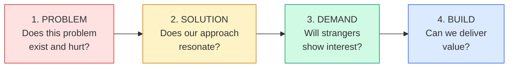
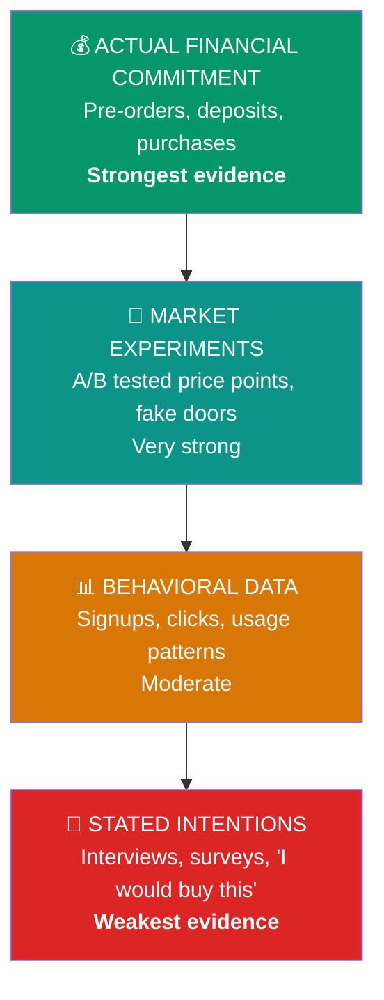
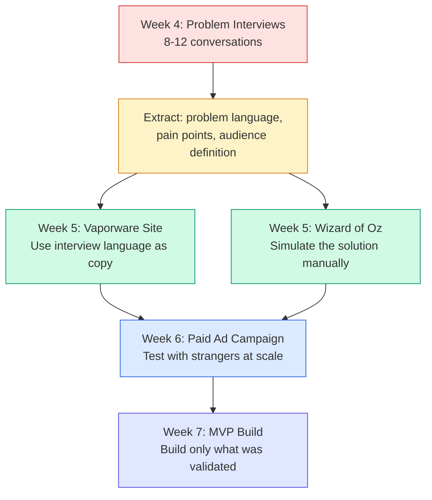

# Report: Pre-Build Concept Validation & Discovery

**Date:** February 9, 2026
**Report Index:** 20260209.01
**Author:** Claude (Opus 4.6)

---

## 1. Governing Question

**What are the most effective techniques for validating a startup concept and testing demand before writing any code or building any product — and how should founders sequence them?**

---

## 2. Why Now

We're at Week 4 of 12 in Startup Studio. Tomorrow (Tuesday, February 10, c6w4) introduces user interviews and concept validation. Teams just formed last week, generated ideas through divergent thinking, and converged on 2-3 concepts via dot voting and Lean Canvases. They have roughly one week to do discovery before building vaporware sites in Week 5.

This research serves three purposes:
1. **Directly inform tomorrow's lecture** on user interviewing and low-fi prototyping
2. **Provide a comprehensive reference** for students doing discovery work this semester
3. **Ground Ken's reply to Elise Adreon** — articulating *why* discovery can't be skipped

The timing is tight. Students need to know exactly what to do this week, not abstract theory.

---

## 3. Methods

- Web-based research (primary — extensive use of current sources)
- Literature review (Fitzpatrick, Blank, Ries, Torres, Maurya, Bland & Osterwalder)
- Comparative analysis (validation techniques against each other)
- Case study analysis (6 positive examples, 6 cautionary tales)
- Analysis of student team submissions (12 teams' current concepts)
- Cross-referencing with course schedule and constraints

---

## 4. Executive Summary

Pre-build validation is the single most important activity a startup team can do, and the one most often skipped. [42% of startups fail because there is no market need for their product](https://www.cbinsights.com/research/report/startup-failure-reasons-top/) — not because the technology didn't work, not because they ran out of money, but because nobody wanted what they built. This is the number one cause of startup death, and it's almost entirely preventable through systematic pre-build validation.

The core insight across every major practitioner — Steve Blank, Rob Fitzpatrick, Eric Ries, Teresa Torres, Ash Maurya — is the same: **talk to people before you build things**. The frameworks differ in structure and emphasis, but they converge on a clear sequence: validate the *problem* first, then the *solution*, then *demand*, and only then commit to building. Most founders get this sequence wrong. [Engineering-driven teams build first. Marketing-driven teams wireframe first. Finance-driven teams demand ROI projections first.](https://davidrogersdigital.substack.com/p/the-four-stages-of-validation) All three skip the most important step: confirming that a real, painful problem exists for real people who will do something about it.

There are roughly 18 distinct pre-build validation techniques available, ranging from zero-cost problem interviews to multi-thousand-dollar crowdfunding campaigns. They produce different types of evidence along a clear hierarchy: what people **say** (weakest), what people **do** (moderate), and what people **pay** (strongest). The art of validation is choosing the right technique for your current stage, reading the signals correctly, and knowing when you have enough evidence to move forward.

For student teams in a 12-week course with 1-2 weeks for discovery, the prescription is specific: conduct 8-12 problem interviews this week using Mom Test principles, synthesize findings into a clear problem statement using the interviewees' own language, then use that language to build a vaporware landing page next week. The interviews don't just validate the idea — they generate the copy, the positioning, and the feature priorities for everything that follows.

---

## 5. Researcher's Position

Having gone deep into this material, I believe the most important thing Ken can communicate to students tomorrow is this: **validation is not a checkbox to get through on your way to building. It's the highest-leverage activity you'll do all semester.**

The temptation for Columbia CS students — technically skilled, ambitious, comfortable with code — will be to treat interviews as a formality and rush to build. This is the [single most common anti-pattern in startup validation](https://www.itamarnovick.com/startup-anti-pattern-4-if-you-build-it-they-will-come/). Y Combinator data shows that [74% of failed startups began with solution fixation rather than problem discovery](https://www.itamarnovick.com/startup-anti-pattern-4-if-you-build-it-they-will-come/), while teams using problem-first validation achieve 3.2x faster product-market fit.

The case studies tell the same story at every scale. Zappos validated that people would buy shoes online by photographing shoes at malls and shipping them manually — no e-commerce platform needed. Buffer validated willingness to pay by putting a pricing page on a landing page before writing a line of code. Dropbox validated demand with a 3-minute video that took their waitlist from 5,000 to 75,000 overnight. Meanwhile, Quibi spent $1.75 billion building a mobile streaming platform without ever validating its core assumption — that people wanted premium short-form content on their phones — and [shut down after six months](https://www.howtheygrow.co/p/why-quibi-died-the-2b-dumpster-fire). Juicero raised $120 million for a juice machine that could be [replaced by human hands squeezing a bag](https://techcrunch.com/2017/09/01/rip-juicero-the-400-venture-backed-juice-machine/).

For this course specifically, here's what I'd emphasize:

1. **The Mom Test is the single most important reading.** Every student should internalize three rules: talk about their life, not your idea; ask about the past, not hypothetical futures; listen more than you talk. If students only learn one thing from this course about validation, let it be this.

2. **8-12 interviews is realistic and sufficient for a 1-week sprint.** Stanford's Lean LaunchPad requires 10-15 per week from teams of 4-5. The [3-of-5 rule from Customer Dev Labs](https://customerdevlabs.com/2017/04/10/how-many-customers-should-you-interview/) is a practical threshold: interview in batches of 5, and if 3 out of 5 describe the same problem the same way, you've found your early adopters.

3. **Interviews are not just validation — they're the raw material for everything that follows.** The problem language interviewees use becomes the headline on the vaporware site. The pain points become the feature bullets. The objections become the FAQ. Students who do good interviews in Week 4 will build better vaporware in Week 5 and write better ad copy in Week 6.

4. **The biggest risk for these teams is confirmation bias, not bad ideas.** The student team submissions report shows strong concepts across the cohort. The risk is that teams hear what they want to hear in interviews, skip the hard questions, and build something that solves the problem they *assumed* people have rather than the one people actually describe.

Confidence: **High** on the validation frameworks, sequencing, and practical recommendations. **High** on the case studies (these are well-documented). **Medium** on the specific conversion rate benchmarks (these vary significantly by context). **High** on the recommendations for student teams — this maps directly to the Lean LaunchPad pedagogy that has been refined over 14 years at Stanford.

— Claude

---

## 6. High-Level Takeaways

- **42% of startups fail due to lack of market need** — and it's the #1 cause of failure. Pre-build validation exists specifically to prevent this. Source: [CB Insights](https://www.cbinsights.com/research/report/startup-failure-reasons-top/)

- **The validation sequence is: Problem → Solution → Demand → Build.** Every major framework agrees. Organizations consistently get it wrong by starting at the stage they're most comfortable with — engineers build, marketers wireframe, finance people demand spreadsheets. Source: [David Rogers](https://davidrogersdigital.substack.com/p/the-four-stages-of-validation)

- **Evidence follows a clear hierarchy: Say < Do < Pay.** What people *say* in interviews is the weakest signal. What they *do* (click, sign up, try) is moderate. What they *pay* (pre-orders, deposits, actual purchases) is strongest. Validation should progressively move up this ladder. Source: [Strategyzer](https://www.strategyzer.com/library/how-strong-is-your-innovation-evidence)

- **The Mom Test's three rules are the foundation of good interviews.** (1) Talk about their life, not your idea. (2) Ask about the past, not the future. (3) Listen more than you talk. Three types of bad data to watch for: compliments, hypothetical fluff, and feature wishlists. Source: [Rob Fitzpatrick](https://www.ricklindquist.com/notes/the-mom-test-by-rob-fitzpatrick)

- **"Cool idea!" is not validation.** Real validation comes from commitments of time (follow-up meetings), reputation (introductions to others), or money (pre-orders). [89% of supportive acquaintances never convert to paying customers.](https://www.fundablestartups.com/blog/validation-mistakes) If someone says "I love it!" but won't introduce you to a friend with the same problem, that's a red flag.

- **Surveys should NEVER be your first validation method.** Surveys presume you know the right questions to ask. Interview first to discover the questions, then survey to quantify the patterns. Students gravitating toward Google Forms instead of conversations is a documented anti-pattern. Source: [Founders Network](https://foundersnetwork.com/startup-idea-validation-mistakes/)

- **8-12 interviews in one week is realistic and sufficient for student teams.** Stanford's Lean LaunchPad expects 10-15 per week. The practical rule: you're done when you can predict what the next person will say before they say it. Source: [Customer Dev Labs](https://customerdevlabs.com/2014/07/01/how-many-customer-discovery-problem-interviews-should-i-do/)

- **Interviews generate raw material for the entire semester.** The words interviewees use become landing page headlines. Pain points become feature bullets. Objections become FAQ content. The interview→vaporware→ads pipeline is a direct chain.

- **The biggest validation mistakes are cognitive, not methodological.** Confirmation bias (hearing what you want to hear), the friends-and-family fallacy (asking people who love you), and solution fixation (skipping the problem) are the three killers. Source: [LinkedIn](https://www.linkedin.com/advice/1/what-best-ways-avoid-confirmation-bias-startup)

- **Every billion-dollar validation failure shared a common trait: skipping the problem.** Quibi ($1.75B lost), Segway (never validated market need), Google Glass (technology looking for a problem), Webvan ($800M lost scaling before proving unit economics). The pattern is consistent across industries and decades.

---

## 7. Detailed Findings

### 7.1 The Validation Sequence: Problem → Solution → Demand → Build

Every major validation framework converges on the same fundamental sequence, though they use different terminology:



[David Rogers' Four Stages of Validation](https://davidrogersdigital.substack.com/p/the-four-stages-of-validation) frames this as Problem Validation → Solution Validation → Product Validation → Business Validation, with a critical insight: **organizations consistently get the sequence wrong**. Finance-driven firms rush to Stage 4 ("Show me the business case first") — resulting in "spreadsheets filled with fictional numbers." Engineering-driven firms start at Stage 3 (building before validating the problem). Marketing-driven firms start at Stage 2 (wireframes before confirming the problem exists).

Here's how the major frameworks map to this sequence:

| Framework | Stage 1 (Problem) | Stage 2 (Solution) | Stage 3 (Demand) | Stage 4 (Build) |
|-----------|-------------------|-------------------|-------------------|-----------------|
| **Blank** (Customer Development) | Customer Discovery | Customer Validation | Customer Creation | Company Building |
| **Ries** (Lean Startup) | Value Hypothesis | Build-Measure-Learn | Growth Hypothesis | Scale |
| **Fitzpatrick** (The Mom Test) | Problem interviews | Commitment asks | Advancement pipeline | — |
| **Torres** (Continuous Discovery) | Opportunity mapping | Assumption testing | Compare 3 solutions | Ship smallest test |
| **Maurya** (Running Lean) | Problem interviews | Demo | Sell (before building) | Build |
| **Strategyzer** (Testing Business Ideas) | Discovery experiments | Validation experiments | Strong evidence | Scale experiments |

Sources: [Steve Blank](https://steveblank.com/tag/customer-development/), [Lean Startup](https://theleanstartup.com/principles), [Sachin Rekhi on Mom Test](https://www.sachinrekhi.com/the-mom-test-rob-fitzpatrick), [Product Talk](https://www.producttalk.org/opportunity-solution-trees/), [LEANFoundry](https://www.leanfoundry.com/lean-1-2-3/feb-24-2024), [Strategyzer](https://www.strategyzer.com/library/testing-business-ideas-book-summary)

Ash Maurya has the most provocative reframe for the sequence: instead of Build → Demo → Sell, he advocates **Demo → Sell → Build**. ["If you can sell the demo, DON'T build the product yet — you've validated demand."](https://www.leanfoundry.com/lean-1-2-3/feb-24-2024)

---

### 7.2 Taxonomy of Pre-Build Validation Techniques

There are roughly 18 distinct techniques available, spanning all four stages. Each produces different types of evidence at different costs. Here's a comprehensive reference table:

| Technique | Stage | Time | Cost | Evidence Strength | Signal Type |
|-----------|-------|------|------|------------------|-------------|
| Problem Interviews | Problem | 2-4 wks | $0-500 | Moderate (qualitative) | Say |
| Solution Interviews | Solution | 1-3 wks | $0-500 | Moderate (qualitative) | Say |
| Surveys | Problem/Solution | 1-2 wks | $0-200 | Weak-Moderate | Say |
| Competitive Analysis | Problem (ongoing) | 1 wk | $50-200 | Supporting input | Observe |
| Paper Prototyping | Solution | Hours-3 days | $0-50 | Weak (usability) | Say |
| Figma Prototypes | Solution/Demand | 3-7 days | $0-200 | Moderate (usability) | Say + Do |
| Landing Page / Smoke Test | Demand | 3-7 days | $100-500 | Moderate (behavioral) | Do |
| Fake Door Test | Demand | 3-5 days | $0-100 | Moderate (behavioral) | Do |
| Waitlist Signups | Demand | 2-8 wks | $0-500 | Moderate (behavioral) | Do |
| Ad Campaign Validation | Demand | 1-2 wks | $100-500 | Moderate (behavioral) | Do |
| Explainer Video Test | Solution/Demand | 1-4 wks | $0-5K | Moderate (behavioral) | Do |
| Social Media Validation | Problem-Demand | 2-8 wks | $0-350/mo | Weak (vanity risk) | Say |
| Email Campaign | Demand/Commit | 4-8 wks | $0-200 | Moderate (engagement) | Do |
| Concierge MVP | Solution/Demand | 4-8 wks | $2K-5K | Strong (behavioral+pay) | Do + Pay |
| Wizard of Oz MVP | Demand/Product | 2-4 wks | $500-2K | Strong (behavioral) | Do |
| Pre-Orders / LOIs | Commit | 4-8 wks | $500-2K | Strong (financial) | Pay |
| Crowdfunding | Commit | 6-8 wks prep | $5K-15K+ | Strong (financial) | Pay |
| Pocket Test / Pub Test | Problem/Solution | Hours-evening | $0-50 | Weak-Moderate (informal) | Say |

Sources: [Naviu](https://www.naviu.tech/blog/how-to-validate-your-startup-idea), [Learning Loop](https://learningloop.io/playbooks/validating-willingness-to-pay), [Strategyzer](https://www.strategyzer.com/library/how-to-select-the-next-best-test-from-the-experiment-library)

#### Mapping Techniques to This Course's Timeline

For Startup Studio's 12-week schedule, here's which techniques map to which weeks:

| Week | Phase | Techniques to Use |
|------|-------|------------------|
| 4 (this week) | Validate | **Problem interviews** (primary), competitive analysis |
| 5 | Prototype | **Vaporware landing page** (smoke test), **Wizard of Oz**, Figma prototypes |
| 6 | Build + Test | **Paid ad campaign** to landing page, start MVP |
| 7 | Build + Test | MVP presentations, iterate based on all signals |
| 10 | Scale | **Second ad campaign**, analytics |
| 11 | Polish | **Final user testing** (solution interviews with real product) |

---

### 7.3 The Evidence Hierarchy: Say vs. Do vs. Pay

Not all validation evidence is created equal. [Strategyzer](https://www.strategyzer.com/library/how-strong-is-your-innovation-evidence) and the [Learning Loop](https://learningloop.io/playbooks/validating-willingness-to-pay) both describe a clear hierarchy of evidence strength:



The core principle: ["Do not trust people's words; we want to get people to put money behind their words."](https://learningloop.io/playbooks/validating-willingness-to-pay) People consistently overstate their willingness to pay and understate their resistance to change.

Rob Fitzpatrick frames this through **currencies of commitment**:

| Currency | Examples | Signal Strength |
|----------|----------|----------------|
| **Time** | Follow-up meeting, trial usage, feedback session | Moderate |
| **Reputation** | Introduction to peers, public endorsement, willing to be a reference | Strong |
| **Money** | Letter of intent, pre-order, deposit, payment | Strongest |

Source: [Sachin Rekhi](https://www.sachinrekhi.com/the-mom-test-rob-fitzpatrick)

["People stop lying when you ask them for money."](https://dualoop.com/en-be/blog/the-mom-test-explained-by-rob-fitzpatrick) — Rob Fitzpatrick

**What this means for student teams:** Your Week 4 interviews (Say-level evidence) are the starting point, not the finish line. The vaporware site in Week 5 tests Do-level evidence (will people sign up?). The paid ad campaign in Week 6 tests Do-level evidence from strangers. Each step up the evidence ladder increases your confidence that you're building something people actually want.

---

### 7.4 How to Do Problem Interviews Right: The Mom Test

Rob Fitzpatrick's [*The Mom Test*](https://www.momtestbook.com/) is the definitive guide to customer interviews, and it's the assigned reading for tomorrow's class. Here are the key principles:

**The Three Rules:**

1. **Talk about their life instead of your idea.** ["If you just pitch your idea, you lock the customer into agreeing politely instead of them telling you what the problem you can fix is."](https://www.atlantaventures.com/blog/the-3-rules-to-customer-interviews-from-the-mom-test)

2. **Ask about specifics in the past instead of generics or opinions about the future.** ["Would you buy a product which did X?" is a terrible question because people are overly optimistic about what they would do and want to make you happy.](https://www.sachinrekhi.com/the-mom-test-rob-fitzpatrick) Instead: "How do you currently solve X and how much does it cost you?"

3. **Talk less and listen more.** ["Active listening is essential as it prevents you from leading customers towards a certain answer."](https://www.atlantaventures.com/blog/the-3-rules-to-customer-interviews-from-the-mom-test)

**Three Types of Bad Data:**

| Type | What It Sounds Like | Why It's Dangerous | Fix |
|------|--------------------|--------------------|-----|
| **Compliments** | "That's so cool!" / "I love it!" | ["The fool's gold of customer learning"](https://mtlynch.io/book-reports/the-mom-test/) | Deflect and return to their life |
| **Fluff** | "I usually..." / "I would definitely..." | Generic, hypothetical, non-binding | Ask: "When's the last time...?" |
| **Ideas** | "You should add X" / "It would be cool if..." | Customers misdiagnose their own needs | Probe motivation: "Why do you want that?" |

**Good Questions vs. Bad Questions:**

| Don't Ask | Why It's Bad | Ask Instead | Why It Works |
|-----------|-------------|-------------|-------------|
| "Do you think this is a good idea?" | Invites compliments | "What's your biggest challenge with [problem area]?" | Focuses on their reality |
| "Would you buy this?" | Hypothetical future | "What have you spent money on to solve this?" | Past behavior = truth |
| "How much would you pay?" | People overstate WTP | "What's the most expensive solution you've tried?" | Actual spending data |
| "Would you use this?" | No cost to say yes | "How often do you encounter this problem?" | Frequency = urgency |
| "What features do you want?" | Generates wishlists | "Walk me through the last time this happened" | Stories reveal real needs |

Sources: [Sachin Rekhi](https://www.sachinrekhi.com/the-mom-test-rob-fitzpatrick), [Rick Lindquist](https://www.ricklindquist.com/notes/the-mom-test-by-rob-fitzpatrick), [TianPan.co](https://tianpan.co/blog/2025-04-29-the-mom-test)

---

### 7.5 Signal Strength: When Have You Validated Enough?

This is one of the hardest questions in validation. Here's what the research says:

#### How Many Interviews?

| Source | Recommendation | Context |
|--------|---------------|---------|
| [Customer Dev Labs](https://customerdevlabs.com/2014/07/01/how-many-customer-discovery-problem-interviews-should-i-do/) | 5 for initial patterns; stop when you stop being surprised | Problem interviews |
| [Customer Dev Labs](https://customerdevlabs.com/2017/04/10/how-many-customers-should-you-interview/) | 3 of 5 (60%) must describe the same problem to move forward | Batch validation |
| [LEANFoundry](https://www.leanfoundry.com/lean-1-2-3/jul-31-2025) | 10-15 per phase | Running Lean process |
| [Lenny's Newsletter](https://www.lennysnewsletter.com/p/how-to-validate-your-b2b-startup) | Median of 30 across successful startups | Pre-build validation (B2B) |
| [GV Design Sprint](https://library.gv.com/the-product-design-sprint-validate-day-5-761292b20d05) | 5 users — "big patterns emerge" | Sprint Day 5 |
| [Teresa Torres](https://www.userinterviews.com/blog/how-to-interview-customers-continuously-with-teresa-torres-of-product-talk) | 1 per week (ongoing) | Continuous discovery |
| [Stanford Lean LaunchPad](https://steveblank.com/2024/06/27/lean-launchpad-stanford-2024-8-teams-in-8-companies-out/) | 10-15 per team per week | University course |

**The practical rule:** ["You're done interviewing customers when you bet $100 you know what the next one will say... and win."](https://customerdevlabs.com/2014/07/01/how-many-customer-discovery-problem-interviews-should-i-do/)

**The 3-of-5 rule:** Interview in batches of 5. If 3 out of 5 describe the same problems in the same way, you've found your early adopters. Move forward. If patterns aren't emerging by interview 5, [don't do more interviews — narrow your customer segment](https://customerdevlabs.com/2014/07/01/how-many-customer-discovery-problem-interviews-should-i-do/).

#### What Constitutes "Strong Signal"?

**Problem Validation — Green Lights:**
- People describe the same problem unprompted across multiple interviews
- They use emotional language ("I hate...", "It drives me crazy...", cursing). [When the Gusto founders heard people start cursing about payroll, they knew they had something.](https://www.lennysnewsletter.com/p/how-to-validate-your-b2b-startup)
- They've already tried to solve it (spent time or money on alternatives)
- They proactively ask for next steps or offer introductions
- They can tell you exactly how much the problem costs them

**Problem Validation — Red Flags:**
- People only agree the problem exists when you describe it to them
- "Yeah, that's kind of annoying" (low emotional intensity)
- They've never tried to solve it or even searched for solutions
- They can't quantify the impact
- Nobody offers a follow-up or referral

**Landing Page Benchmarks (for Week 5-6):**

| Benchmark | Rate | Source |
|-----------|------|--------|
| Average landing page conversion (all industries) | ~6.6% | [Unbounce](https://unbounce.com/average-conversion-rates-landing-pages/) |
| Below average (red flag) | <1% | [Unbounce](https://unbounce.com/landing-pages/whats-a-good-conversion-rate/) |
| Acceptable | 2-5% | [Unbounce](https://unbounce.com/landing-pages/whats-a-good-conversion-rate/) |
| Good | 5-10% | [Unbounce](https://unbounce.com/landing-pages/whats-a-good-conversion-rate/) |
| Top 25% | 10%+ | [Unbounce](https://unbounce.com/landing-pages/whats-a-good-conversion-rate/) |
| Smoke test minimum traffic | 1,000+ visitors | [Bundl](https://www.bundl.com/articles/techniques-validating-purchase-intention-in-4-easy-steps-the-smoke-test) |

**Critical context:** Set your success threshold BEFORE running the test. A 2% conversion rate with the right audience can be more meaningful than 10% with the wrong one.

Sources: [LEANFoundry](https://www.leanfoundry.com/lean-1-2-3/jul-31-2025), [Lenny's Newsletter](https://www.lennysnewsletter.com/p/how-to-validate-your-b2b-startup), [Tyler Myracle](https://www.tylermyracle.com/articles/startup-validation-framework)

---

### 7.6 The Seven Deadly Validation Mistakes

These are the most common ways early founders go wrong with validation, ordered by frequency and severity:

#### Mistake 1: Building Before Validating

**The deadliest anti-pattern.** [74% of failed startups began with solution fixation rather than problem discovery.](https://www.itamarnovick.com/startup-anti-pattern-4-if-you-build-it-they-will-come/) Building feels productive. Talking to people feels uncertain. Technical founders default to what they know: code.

**Why founders do it:** Building is controllable. Code does what you tell it. Humans are unpredictable and sometimes say things you don't want to hear.

**The cost:** Months of engineering on the wrong thing. Emotional attachment to the product that makes pivoting harder. By the time you launch and discover nobody wants it, you've burned through your runway.

#### Mistake 2: Confirmation Bias

[Confirmation bias](https://www.linkedin.com/advice/1/what-best-ways-avoid-confirmation-bias-startup) is the tendency to seek, interpret, and remember information that confirms your pre-existing beliefs while ignoring contradictory evidence. Founders cherry-pick the 2 positive responses and forget the 8 neutral ones. They interpret "that's interesting" as "I would buy this."

**Fix:** Have a non-founder conduct some interviews. Write down hypotheses BEFORE interviews. Keep a running tally of positive, neutral, and negative responses. Talk to strangers, not just your network.

#### Mistake 3: The Friends & Family Fallacy

[89% of supportive acquaintances never convert to paying customers.](https://www.fundablestartups.com/blog/validation-mistakes) [68% of failed founders retrospectively acknowledged mistaking social validation for market validation.](https://foundersnetwork.com/startup-idea-validation-mistakes/) Your mom will always say your idea is great because she loves you, not because it's true.

**Fix:** No more than 5 of your first 30 interviews should be from your personal network. Sell to people you don't know. Follow the Mom Test rules to make your questions so good that even your mom can't lie.

#### Mistake 4: The Compliment Trap

"I love it! Let me know when it launches" is not validation. ["That sounds amazing!" is not the same as "Here's my credit card."](https://www.sachinrekhi.com/the-mom-test-rob-fitzpatrick) People say nice things to avoid social conflict. Compliments are [the fool's gold of customer learning](https://mtlynch.io/book-reports/the-mom-test/).

**Fix:** Deflect compliments and seek commitments. Will they give you time (a follow-up meeting)? Reputation (an introduction to someone else with the problem)? Money (a pre-order)?

#### Mistake 5: Surveying Before Interviewing

Students gravitate toward surveys — they're easier, less scary, and produce numbers that feel objective. But [surveys presume you already know the right questions](https://foundersnetwork.com/startup-idea-validation-mistakes/). In early validation, you don't know what you don't know. Interviews let you discover the questions; surveys let you quantify the answers.

**When surveys ARE useful:** After you've done interviews and know the right questions. For quantifying patterns you've already discovered qualitatively.

#### Mistake 6: Validating the Wrong Thing

Validating that your *solution is cool* instead of validating that the *problem is real and painful*. ["People love our demo!" — but nobody has the problem it solves.](https://www.failory.com/blog/how-to-validate-startup-ideas)

**The hierarchy:** First validate the PROBLEM exists and is painful. Then validate people are actively trying to solve it. Then validate your SOLUTION is better than alternatives. Then validate they'll PAY.

**Key test:** "How have you tried to solve this problem in the past?" If they've never looked for a solution, they probably won't buy yours.

#### Mistake 7: Waiting for 100% Certainty

["Follow the 80% rule: get just enough valid information from customer interviews and other data sources and then decide. You will never get to 100% certainty."](https://www.productplan.com/lean-market-validation-10-ways-rapidly-test-startup-idea/) Perfectionism kills momentum. The goal is not to eliminate all risk — it's to reduce uncertainty enough to take the next step.

Sources: [Founders Network](https://foundersnetwork.com/startup-idea-validation-mistakes/), [Fundable Startups](https://www.fundablestartups.com/blog/validation-mistakes), [CB Insights](https://www.cbinsights.com/research/report/startup-failure-reasons-top/)

---

### 7.7 Case Studies

#### Companies That Validated Before Building

**Zappos — Wizard of Oz MVP (1999)**
Nick Swinmurn had a hypothesis: people would buy shoes online without trying them on. Instead of building an e-commerce platform, he photographed shoes at local malls, posted them on a basic website, and when orders came in, he went back to the store, bought the shoes at retail price, and shipped them manually. Customers had no idea it was a one-man operation. This validated the core assumption — people WOULD buy shoes online — before any technology investment. [Zappos was acquired by Amazon for $1.2 billion.](https://www.verticode.co.uk/blog/zappos-mvp-example)

**Buffer — Landing Page with Pricing Test (2010)**
Joel Gascoigne built a 2-page website: Page 1 described Buffer's value proposition with a "Plans & Pricing" button. Page 2 showed three pricing tiers. Page 3 collected email addresses. The critical innovation: [the pricing page tested willingness to pay, not just interest](https://buffer.com/resources/idea-to-paying-customers-in-7-weeks-how-we-did-it/). Result: 100 email signups and 3 paying customers in month one — before any code was written. He then built the product in 7 weeks. Buffer is now a company with tens of millions in annual revenue.

**Dropbox — Explainer Video MVP (2007)**
Drew Houston couldn't explain file sync easily in text. He created a [3-minute demo video](https://thriveandgrow.com/2025/05/17/pre-launch-traction-how-dropbox-got-75000-signups/) showing how Dropbox would work. He posted it on Hacker News ("My YC app: Dropbox — Throw away your USB drive") and Digg, including inside jokes aimed at the Digg community. Beta signup list went from 5,000 to 75,000 overnight. This validated the value hypothesis — "Was file synchronization a problem that most people didn't know they had?" — before the product existed.

**Groupon — WordPress Blog MVP (2008)**
The original Groupon was literally a WordPress blog. Andrew Mason would [manually negotiate deals with local businesses, write them up as blog posts, and send a daily email](https://medium.com/rocket-startup/how-groupon-built-an-mvp-without-tech-and-validated-an-idea-in-a-month-53ed8845affd). The first "group coupon" was for a pizza place in the building where The Point (the original company) was headquartered. When enough people committed, they generated the coupons in FileMaker and sent them by email. No platform, no app, no marketplace technology. Just a blog and manual effort to prove the concept worked.

**Food on the Table — Concierge MVP (2010)**
CEO Manuel Rosso (previously IMVU's first VP of Marketing) [personally visited each customer, gathered food preferences, searched local store sales, created shopping lists and meal plans, and delivered them](https://ibuildmvps.com/blog/the-concierge-minimum-viable-product-maximizes-customer-learning/). He charged $9.95 for the manual service. He conducted over 150 customer conversations and held 20 "Kitchen Table" discussion groups. Key insight: "Code should only remove bottlenecks." Build technology to automate what's already proven to work manually.

#### Companies That Skipped Validation

**Quibi — $1.75 Billion Without Validating Core Assumption (2018-2020)**
Jeffrey Katzenberg (former Disney chairman) and Meg Whitman (ex-CEO of eBay/HP) raised [$1.75 billion to build a mobile-first streaming platform with premium short-form content](https://www.howtheygrow.co/p/why-quibi-died-the-2b-dumpster-fire). The core assumption — people wanted premium 5-10 minute content on mobile for on-the-go consumption — was never tested. They spent $7.5M per episode on content, $100M on marketing (including Super Bowl ads), and built proprietary "Turnstyle" technology for seamless portrait/landscape viewing. They projected 7 million subscribers; they got about 500,000. [70% of survey respondents thought Quibi was a food delivery service.](https://www.howtheygrow.co/p/why-quibi-died-the-2b-dumpster-fire) They shut down after just 6 months. Sold to Roku for $100M — a 94% loss.

**Juicero — $120M Building a Solution Nobody Needed (2013-2017)**
Juicero raised [$120 million from top VCs (Google Ventures, Kleiner Perkins)](https://techcrunch.com/2017/09/01/rip-juicero-the-400-venture-backed-juice-machine/) for a Wi-Fi-connected cold-press juicer ($699, later $399) that used proprietary pouches ($5-8 each). In April 2017, [Bloomberg showed the pouches could be squeezed by hand](https://www.codemotion.com/magazine/dev-life/stories/the-downfall-of-juicero-the-overhyped-high-tech-juicer/) — no machine needed. The company was losing approximately $4 million per month. It shut down in September 2017. A simple test — giving people the pouches and seeing if they needed a machine — would have killed the idea before $120M was spent.

**Segway — Massive Hype, Zero Market Research (2001-2020)**
Dean Kamen spent roughly six years developing the Segway PT. Steve Jobs said it ["could be bigger than the personal computer"](https://slate.com/human-interest/2021/08/dean-kamen-viral-mystery-invention-2001.html). VC John Doerr said it "could be bigger than the internet." [No market research was ever conducted](https://www.destination-innovation.com/why-did-the-segway-fail-some-innovation-lessons/) to validate the price point ($5,000) or the market need. Kamen expected to sell 10,000 units per week; six years in, only ~30,000 total had sold. Regulatory problems (banned from sidewalks AND roads) were never anticipated. Production ended in 2020 after selling just 140,000 units over 19 years.

**Webvan — $800M Scaling Before Proving Unit Economics (1999-2001)**
Online grocery delivery startup that [raised nearly $800 million](https://techcrunch.com/2013/09/27/why-webvan-failed-and-how-home-delivery-2-0-is-addressing-the-problems/). IPO'd in 1999 raising another $375M despite less than $5M in revenue. Signed a $1 billion contract with Bechtel to build warehouses. The problem: [each order lost $30-50](https://marketersunited.com/2025/07/11/case-study-webvan-a-strategic-collapse-of-billion-dollar-proportions/). The more they sold, the more they lost. They expanded to multiple cities without proving the model in one market. Filed for bankruptcy in June 2001 — IPO to bankruptcy in 20 months.

**Google Glass — Technology Looking for a Problem (2012-2015)**
Google built AR smart glasses as a technology research project and tried to find a consumer market. They [intentionally didn't define the problem Glass was solving](https://startuptalky.com/google-glass-failure-case-study/). Privacy backlash was massive — users were called "Glassholes." Restaurants and bars banned the devices. No clear consumer use case emerged. The consumer program was shut down in January 2015. Glass eventually found a niche in enterprise (manufacturing, surgery) — but the consumer failure cost years and enormous resources.

**Color Labs — $41M, No Product-Market Fit (2011-2012)**
Founded by serial entrepreneur Bill Nguyen (who had sold Lala to Apple). [Raised $41 million before launch.](https://thegreatfail.com/episode/how-color-labs-bled-out/) Built a proximity-based photo-sharing app. Users didn't understand the interface or purpose. Initial App Store rating: 2 out of 5 stars. The founders admitted: "We threw a mountain at people." The app ["didn't address a clear need or problem that users had."](https://stupidfounder.com/the-41-million-startup-that-never-found-its-place/) Sold to Apple for $7M — an 83% loss.

**The pattern across all failures:** The more money raised before validation, the bigger the disaster. The more sophisticated the technology, the greater the risk of solving problems customers don't actually have.

---

### 7.8 The Key Practitioner Frameworks

#### Steve Blank — Customer Development

[Customer Development](https://steveblank.com/tag/customer-development/) is the foundational framework. The most famous phrase: **"There are no facts inside your building, so get outside to test them."** The model has four steps, but only the first two are pre-build:

1. **Customer Discovery:** State hypotheses about your customer and problem. Get out of the building. Test the problem. Test the solution concept. Verify or pivot. Source: [MaRS](https://learn.marsdd.com/article/blanks-customer-discovery-method-part-2-the-customer-development-model-in-value-proposition/)

2. **Customer Validation:** Build an MVP. Test selling. Develop a sales roadmap. If you can't find enough paying customers, [loop back to Customer Discovery](https://steveblank.com/tag/customer-development/) — this is not failure, it's how the process works.

The loop-back is critical. Blank's model assumes multiple iterations. The Stanford Lean LaunchPad course (which Blank teaches) requires 10-15 customer interviews per team per week, and in 2024, [all 8 teams formed companies](https://steveblank.com/2024/06/27/lean-launchpad-stanford-2024-8-teams-in-8-companies-out/) — the first time in 14 years.

#### Rob Fitzpatrick — The Mom Test

[The Mom Test](https://www.momtestbook.com/) is the most practical, hands-on resource for customer interviews. Covered in detail in Section 7.4 above. The key contribution beyond the three rules is the **currencies of commitment** — the idea that validation isn't binary (yes/no) but exists on a spectrum of commitment from time to reputation to money. A meeting succeeds [only when it ends with a commitment to advance to the next step](https://dualoop.com/en-be/blog/the-mom-test-explained-by-rob-fitzpatrick).

#### Teresa Torres — Continuous Discovery Habits

[Torres's Opportunity Solution Tree](https://www.producttalk.org/opportunity-solution-trees/) is the most sophisticated framework for organizing discovery work. It starts with a desired outcome, branches into customer opportunities (needs, pain points, desires — never solutions), then into potential solutions, and finally into assumption tests. The key insight: ["Start with a teeny tiny opportunity — which is the value of opportunity mapping — it turns big evergreen opportunities into smaller, more solvable opportunities."](https://userpilot.com/blog/continuous-discovery-framework-teresa-torres/)

Her practical advice: [compare and contrast at least 3 solutions](https://www.producttalk.org/opportunity-solution-trees/) for your target opportunity, and test the riskiest assumptions from each. This prevents teams from overcommitting to their first idea.

#### Ash Maurya — Running Lean

Maurya's contribution is the **Demo → Sell → Build** sequence and the concept of Problem/Solution Fit as a distinct milestone before Product/Market Fit. His [LEANFoundry 90-day framework](https://www.leanfoundry.com/lean-1-2-3/jul-31-2025) prescribes three phases: Problem Discovery (weeks 1-4), Solution Design (weeks 5-8), and Offer Delivery (weeks 9-12). Success threshold: at least 30% showing high problem intensity in discovery, and 80%+ commitment from qualified early adopters in the offer phase.

The killer example from Maurya: ["12 out of 15 architects committed to paying $5,000/month before he wrote a single line of code"](https://www.leanfoundry.com/lean-1-2-3/jul-31-2025) — an 80% conversion from qualified early adopters.

#### Strategyzer — Testing Business Ideas

David Bland and Alex Osterwalder's contribution is the [Assumption Mapping framework](https://www.strategyzer.com/library/how-assumptions-mapping-can-focus-your-teams-on-running-experiments-that-matter): identify all assumptions, map them on a 2x2 matrix (importance vs. evidence), and focus experiments on the top-right quadrant — critical beliefs with the least evidence.

Their [experiment selection principle](https://www.strategyzer.com/library/how-to-select-the-next-best-test-from-the-experiment-library): "Start cheap and fast — aim for 1 experiment per week, ~12 experiments over 12 weeks." This maps perfectly to a semester timeline.

---

### 7.9 What Good Looks Like for Student Teams in a 12-Week Semester

This is the most course-specific section of the report. Given the timeline — it's Week 4 of 12 and teams are just starting validation — here's a realistic plan.

#### The Constraint

Looking at the [course schedule](../../classes/class_schedule.md): teams formed in Week 3, generated ideas via divergent thinking on Thursday (c5w3), and tomorrow (c6w4, Tuesday Feb 10) is their first exposure to validation techniques. They have the following week's Tuesday (c7w4, Feb 12) to define their audience based on interview learnings. Then Week 5 pivots to building vaporware.

That means teams have roughly **5-7 working days** for their initial validation sprint. This is tight but not unprecedented — [the Google Ventures Design Sprint](https://www.thesprintbook.com/the-design-sprint) goes from problem to validated prototype in 5 days.

#### A Realistic Week 4 Validation Sprint

**Days 1-2 (Tue-Wed): Prepare and Start Interviewing**
- Each team member commits to 2-3 interviews (target: 8-12 total per team)
- Pair up: one asks questions, one takes notes
- Use the Mom Test question framework (covered in class Tuesday)
- 15-20 minutes per interview — shorter is better for beginners

**Days 3-5 (Thu-Sat): Complete Interviews and Synthesize**
- Finish remaining interviews
- Create [interview snapshots](https://www.producttalk.org/2024/02/interview-snapshot/) after each interview (one-page summary: who, key quote, pain points, insights)
- Saturday: team debrief — what patterns emerged? What surprised us?

**Days 6-7 (Sun-Mon): Synthesize for Vaporware**
- Identify the top problem statement (using interviewees' language)
- List the 3-5 most common pain points
- Draft the landing page headline and feature bullets from interview language
- Decide: are we building the right thing? Do we need to adjust?

#### Where to Find Interviewees

Student teams have significant advantages in user access:

| Target User | Where to Find Them | Access Strategy |
|-------------|-------------------|-----------------|
| Columbia students | Campus, dorms, libraries, dining halls | Walk up and ask — shared context makes this easy |
| NYC residents | Coffee shops, coworking spaces, parks | Approach respectfully with a clear ask |
| Gym-goers | Campus gym, NYC gyms | Go during peak hours (5-7 PM) |
| Renters / apartment hunters | Reddit (r/NYCapartments), Craigslist, Facebook groups | Post in relevant communities |
| Job seekers / interview preppers | Career services, LinkedIn, campus job boards | Leverage Columbia network |
| Any specific demographic | Online communities (Reddit, Discord, Facebook Groups) | Find where your target users already gather |

**Key principle from Teresa Torres:** [Finding participants before you have customers](https://www.producttalk.org/finding-interview-participants-before-customers/) requires creativity, but the answer is almost always: go where the people already are.

#### Interview Script Template

```
OPENING (2 min)
"Hey, I'm [name], I'm working on a class project at Columbia
about [problem area]. I'm trying to understand how people
deal with [problem]. Mind if I ask you a few questions?
It'll take about 15 minutes."

PROBLEM EXPLORATION (8-10 min)
"Tell me about the last time you [relevant activity]."
"What was the hardest part about that?"
"How do you currently deal with [problem]?"
"Have you tried any tools/apps/services to help?"
"How much time/money does this cost you?"
"If you could wave a magic wand, what would change?"

WRAP-UP (2 min)
"This has been really helpful. Is there anything I should
have asked about that I didn't?"
"Do you know 1-2 other people who deal with [problem]?"
"Thanks so much."
```

Source: Adapted from [Customer Dev Labs](https://customerdevlabs.com/2013/11/05/how-i-interview-customers/) and [The Mom Test](https://www.ricklindquist.com/notes/the-mom-test-by-rob-fitzpatrick)

#### How Interviews Feed the Semester Pipeline



The interview-to-vaporware pipeline is direct:

| Interview Finding | Landing Page Element |
|------------------|---------------------|
| Problem description (their words) | Headline / hero text |
| Specific pain points | Feature bullets |
| Desired outcome | Value proposition / subheadline |
| Current solution frustrations | "Why [Product] vs [Alternatives]" section |
| Most compelling quote | Social proof / testimonial |
| Objections and concerns | FAQ section |

Source: [ABmatic](https://abmatic.ai/blog/how-to-use-customer-pain-points-to-target-saas-landing-page-messaging), [Cursorup](https://www.cursorup.com/blog/pain-points)

#### Decision Framework After Interviews

After completing interviews, teams should answer these questions:

| Signal | Green Light (Proceed) | Yellow (Modify) | Red (Pivot) |
|--------|----------------------|-----------------|-------------|
| Problem exists? | 3+ people describe it unprompted | People acknowledge when prompted, say "not that bad" | Nobody recognizes it |
| People trying to solve it? | At least 1 has spent money on alternatives | Using free/easy workarounds that work "well enough" | Solved it years ago, don't think about it |
| Emotional intensity? | "I hate this" / cursing / detailed stories | Mild frustration, shrug | Indifference |
| Commitments? | Follow-up meetings, referrals, "when can I try it?" | Interest but no commitments | Zero referrals, no follow-up requests |
| Language consistency? | Can state the problem in one sentence using their words | Everyone describes a different problem | No common thread |

#### What Stanford's Lean LaunchPad Expects

For comparison, [Stanford's ENGR 245 (Lean LaunchPad)](https://steveblank.com/2024/06/27/lean-launchpad-stanford-2024-8-teams-in-8-companies-out/) — the gold standard for university startup validation courses — requires:
- Teams of 4-5 (same as us)
- 10-15 customer interviews per team per week
- Total interviews per cohort: 900+ over the quarter
- Time commitment: 15-20 hours/week (double a normal class)
- Weekly presentations of findings and pivots
- Hypothesis-driven approach: formulate 3-4 hypotheses per week, test them through interviews

The [NSF I-Corps program](https://www.nsf.gov/funding/initiatives/i-corps/about-i-corps), which adapts this methodology nationally, requires a minimum of 100 face-to-face interviews over 7 weeks. Our course won't hit those numbers, but the methodology is the same.

---

### 7.10 Practitioner Reading List with Key Takeaways

| Book | Author | Key Takeaway for This Course | When to Read |
|------|--------|------------------------------|-------------|
| *The Mom Test* | Rob Fitzpatrick | The three rules of customer interviews; compliments are worthless, commitments are gold | **Week 4 (assigned)** |
| *Sprint* | Jake Knapp | Prototype chapter: how to build something testable in one day | **Week 5** |
| *The Lean Startup* | Eric Ries | MVP is about learning, not building; validated learning as the unit of progress | Week 7 (assigned) |
| *Lean UX* | Jeff Gothelf | Hypothesis-driven design; collaborative cross-functional teams | Ongoing reference |
| *Interviewing Users* | Steve Portigal | Advanced interview techniques; deeper than The Mom Test on methodology | Week 11 (assigned) |
| *Continuous Discovery Habits* | Teresa Torres | Opportunity Solution Trees; weekly interview cadence; compare 3 solutions | For teams that continue post-course |
| *Running Lean* | Ash Maurya | Demo→Sell→Build; Problem/Solution Fit as first milestone | For teams that continue post-course |
| *Testing Business Ideas* | David Bland & Alex Osterwalder | Assumption mapping; 44 experiments organized by evidence strength | For teams that continue post-course |

---

## 8. Citations

### Books and Frameworks
1. Fitzpatrick, Rob. *The Mom Test.* [momtestbook.com](https://www.momtestbook.com/). Summarized via [Rick Lindquist](https://www.ricklindquist.com/notes/the-mom-test-by-rob-fitzpatrick), [Sachin Rekhi](https://www.sachinrekhi.com/the-mom-test-rob-fitzpatrick), [Michael Lynch](https://mtlynch.io/book-reports/the-mom-test/), [Dualoop](https://dualoop.com/en-be/blog/the-mom-test-explained-by-rob-fitzpatrick), [Atlanta Ventures](https://www.atlantaventures.com/blog/the-3-rules-to-customer-interviews-from-the-mom-test)
2. Blank, Steve. *The Four Steps to the Epiphany.* [steveblank.com](https://steveblank.com/tag/customer-development/). Also: [Wikipedia](https://en.wikipedia.org/wiki/Customer_development), [UCSD Innovation](https://innovation.ucsd.edu/startup/startup-toolkit/Steve-Blank-CustDev.pdf), [MaRS](https://learn.marsdd.com/article/the-customer-development-model-cdm-product-development-and-technology-startups/)
3. Ries, Eric. *The Lean Startup.* [theleanstartup.com](https://theleanstartup.com/principles). Also: [Wikipedia](https://en.wikipedia.org/wiki/Lean_startup), [Lean Startup Co.](https://leanstartup.co/resources/articles/what-is-an-mvp/)
4. Torres, Teresa. *Continuous Discovery Habits.* [producttalk.org](https://www.producttalk.org/opportunity-solution-trees/). Also: [Userpilot](https://userpilot.com/blog/continuous-discovery-framework-teresa-torres/), [Product School](https://productschool.com/blog/product-fundamentals/opportunity-solution-tree)
5. Maurya, Ash. *Running Lean.* [LEANFoundry](https://www.leanfoundry.com). Also: [FourWeekMBA](https://fourweekmba.com/running-lean-ash-maurya/), [Shortform](https://www.shortform.com/blog/running-lean-ash-maurya/)
6. Bland, David & Osterwalder, Alex. *Testing Business Ideas.* [Strategyzer](https://www.strategyzer.com/library/testing-business-ideas-book-summary). Also: [Assumption Mapping](https://www.strategyzer.com/library/how-assumptions-mapping-can-focus-your-teams-on-running-experiments-that-matter), [Evidence Strength](https://www.strategyzer.com/library/how-strong-is-your-innovation-evidence)
7. Knapp, Jake. *Sprint.* [thesprintbook.com](https://www.thesprintbook.com/the-design-sprint). Also: [GV](https://www.gv.com/sprint/), [Day 5 Validate](https://library.gv.com/the-product-design-sprint-validate-day-5-761292b20d05)

### Validation Methodology Sources
8. David Rogers. ["The Four Stages of Validation."](https://davidrogersdigital.substack.com/p/the-four-stages-of-validation) Substack.
9. Learning Loop. ["Validating Willingness to Pay"](https://learningloop.io/playbooks/validating-willingness-to-pay), ["Concierge MVP"](https://learningloop.io/plays/concierge), ["Wizard of Oz"](https://learningloop.io/plays/wizard-of-oz), ["Fake Door Testing"](https://learningloop.io/plays/fake-door-testing).
10. Customer Dev Labs. ["How Many Interviews"](https://customerdevlabs.com/2014/07/01/how-many-customer-discovery-problem-interviews-should-i-do/), ["Batch Validation"](https://customerdevlabs.com/2017/04/10/how-many-customers-should-you-interview/), ["How I Interview"](https://customerdevlabs.com/2013/11/05/how-i-interview-customers/).
11. Tyler Myracle. ["Startup Validation Framework."](https://www.tylermyracle.com/articles/startup-validation-framework)
12. Lenny Rachitsky. ["How to Validate Your B2B Startup."](https://www.lennysnewsletter.com/p/how-to-validate-your-b2b-startup)
13. LEANFoundry. ["90-Day Validation Framework."](https://www.leanfoundry.com/lean-1-2-3/jul-31-2025)
14. Naviu. ["25 Proven Ways to Validate."](https://www.naviu.tech/blog/how-to-validate-your-startup-idea)

### Case Studies
15. Buffer: [Joel Gascoigne, "Idea to Paying Customers in 7 Weeks"](https://buffer.com/resources/idea-to-paying-customers-in-7-weeks-how-we-did-it/)
16. Dropbox: [Thrive and Grow, "Pre-Launch Traction"](https://thriveandgrow.com/2025/05/17/pre-launch-traction-how-dropbox-got-75000-signups/)
17. Zappos: [Verticode, "Zappos MVP Example"](https://www.verticode.co.uk/blog/zappos-mvp-example)
18. Groupon: [Medium/Rocket Startup](https://medium.com/rocket-startup/how-groupon-built-an-mvp-without-tech-and-validated-an-idea-in-a-month-53ed8845affd)
19. Food on the Table: [iBuild MVPs](https://ibuildmvps.com/blog/the-concierge-minimum-viable-product-maximizes-customer-learning/)
20. Quibi: [How They Grow](https://www.howtheygrow.co/p/why-quibi-died-the-2b-dumpster-fire)
21. Juicero: [TechCrunch](https://techcrunch.com/2017/09/01/rip-juicero-the-400-venture-backed-juice-machine/), [Codemotion](https://www.codemotion.com/magazine/dev-life/stories/the-downfall-of-juicero-the-overhyped-high-tech-juicer/)
22. Segway: [Slate](https://slate.com/human-interest/2021/08/dean-kamen-viral-mystery-invention-2001.html), [Destination Innovation](https://www.destination-innovation.com/why-did-the-segway-fail-some-innovation-lessons/)
23. Webvan: [TechCrunch](https://techcrunch.com/2013/09/27/why-webvan-failed-and-how-home-delivery-2-0-is-addressing-the-problems/), [Marketers United](https://marketersunited.com/2025/07/11/case-study-webvan-a-strategic-collapse-of-billion-dollar-proportions/)
24. Google Glass: [StartupTalky](https://startuptalky.com/google-glass-failure-case-study/)
25. Color Labs: [The Great Fail](https://thegreatfail.com/episode/how-color-labs-bled-out/), [The Stupid Founder](https://stupidfounder.com/the-41-million-startup-that-never-found-its-place/)

### Anti-Patterns and Mistakes
26. CB Insights. ["Top Reasons Startups Fail."](https://www.cbinsights.com/research/report/startup-failure-reasons-top/)
27. Itamar Novick. ["Startup Anti-Pattern #4: If You Build It, They Will Come."](https://www.itamarnovick.com/startup-anti-pattern-4-if-you-build-it-they-will-come/)
28. Founders Network. ["Top 10 Startup Idea Validation Mistakes."](https://foundersnetwork.com/startup-idea-validation-mistakes/)
29. Fundable Startups. ["Common Startup Validation Mistakes."](https://www.fundablestartups.com/blog/validation-mistakes)
30. LinkedIn. ["Best Ways to Avoid Confirmation Bias."](https://www.linkedin.com/advice/1/what-best-ways-avoid-confirmation-bias-startup)

### Benchmarks and Data
31. Unbounce. ["Average Conversion Rates."](https://unbounce.com/average-conversion-rates-landing-pages/)
32. Bundl. ["The Smoke Test."](https://www.bundl.com/articles/techniques-validating-purchase-intention-in-4-easy-steps-the-smoke-test)
33. GrowthMentor. ["Startup Idea Validation."](https://www.growthmentor.com/blog/startup-idea-validation/)

### Academic / University Programs
34. Steve Blank. ["Lean LaunchPad Stanford 2024."](https://steveblank.com/2024/06/27/lean-launchpad-stanford-2024-8-teams-in-8-companies-out/)
35. NSF I-Corps. ["About I-Corps."](https://www.nsf.gov/funding/initiatives/i-corps/about-i-corps)
36. Invent Penn State. ["Customer Discovery 101."](https://invent.psu.edu/programs/cd101/)
37. Teresa Torres / Product Talk. ["Interview Snapshot."](https://www.producttalk.org/2024/02/interview-snapshot/), ["Customer Interviews."](https://www.producttalk.org/customer-interviews/), ["Finding Participants."](https://www.producttalk.org/finding-interview-participants-before-customers/)

### Tools and Templates
38. [Kromatic Note-Taking Template](https://www.kromatic.com/innovation-resources/customer-discovery-note-taking-template)
39. [Interview Snapshot Template (Miro)](https://miro.com/miroverse/interview-snapshot-template/)
40. [Interview Snapshot Template (Figma)](https://www.figma.com/community/file/1118814957669913350/interview-snapshots-template)
41. [Penn State Customer Discovery 101 Workbook (PDF)](https://customerdiscovery101.launchbox.psu.edu/files/Customer%20Discovery%20101%20Workbook%203-21-24.pdf)

### Course Materials
42. Student Team Submissions Report: [reports/20260208.01_student-team-submissions/](../20260208.01_student-team-submissions/report_student-team-submissions.md)
43. Course Syllabus: [resources/course_syllabus.md](../../resources/course_syllabus.md)
44. Class Schedule: [classes/class_schedule.md](../../classes/class_schedule.md)
45. Divergent Thinking Outline: [classes/20260205_c5w3_thu_divergent-thinking/](../../classes/20260205_c5w3_thu_divergent-thinking/outline_c5w3_thu_divergent-thinking.md)
